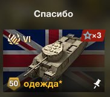
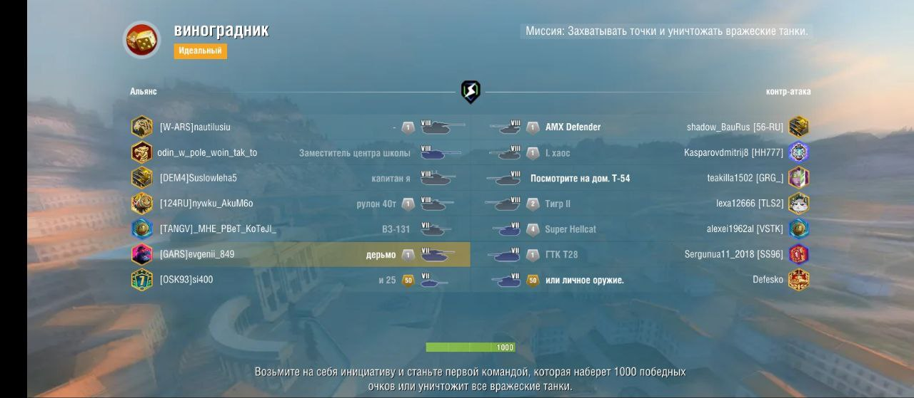
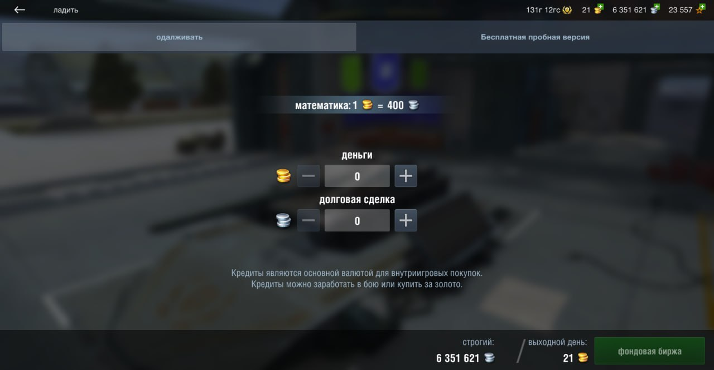
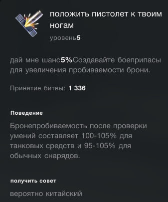
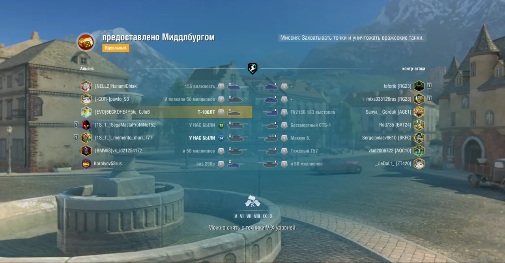

# WoT Blitz - Locale RU GoogleTranslate

## Description
* [en](public/desc/en.txt)
* [ru](public/desc/ru.txt)

## Install
### Manual install
1. Download suitable `.zip` file from **Releases** section
2. Unpack chosen `.zip` file to `~res:/`

`~res:/` is the gamedata root:
- Android: `/your_sdcard/Android/data`
- Steam: `\Path\To\Steam\steamapps\common\World of Tanks Blitz`

### Build from source

Dependencies
- [`dvpl` converter](https://github.com/Maddoxkkm/dvpl_converter)
- `make`
- `coreutils` (or any other similar utilites)
- [`translate-shell`](https://github.com/soimort/translate-shell)
Optional
- [`yamllint`](https://yamllint.readthedocs.io) (to help troubleshooting)

wip

### Install from source
wip

## Distribute
wip